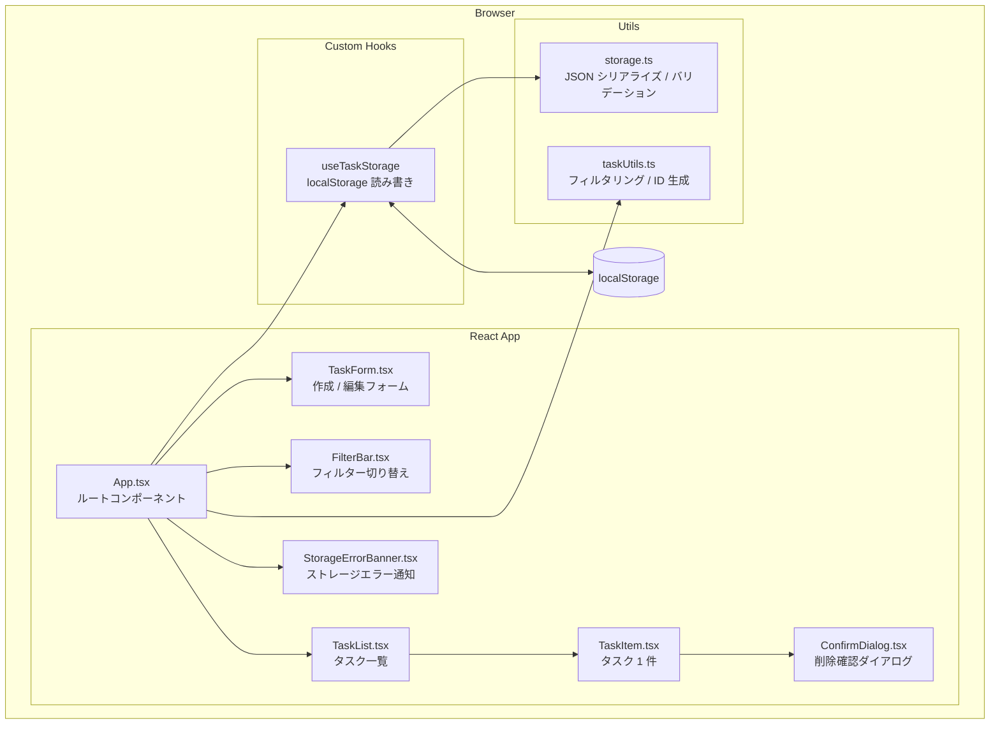
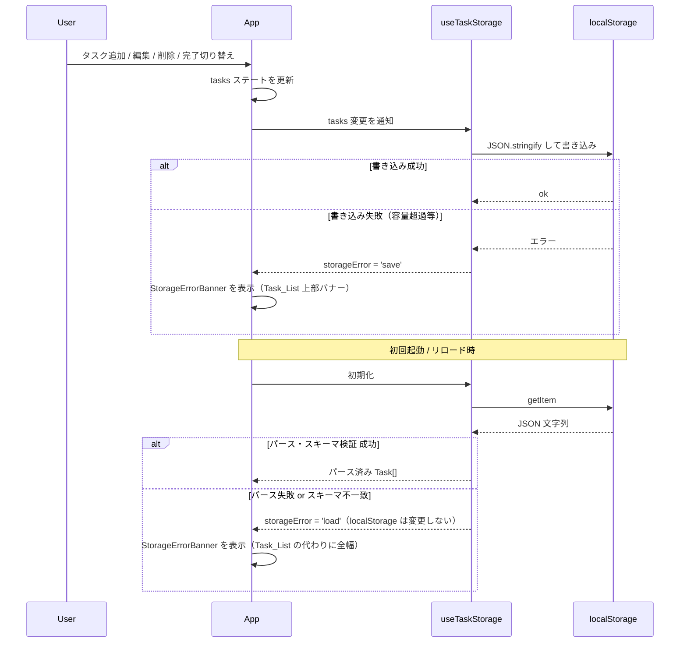

# Design Document: TaskFlow ToDo 管理 Web アプリ

## Overview

TaskFlow は React + TypeScript で構築されるシンプルな ToDo 管理アプリです。ユーザーはタスクの追加・編集・削除・完了切り替えをブラウザ上で行え、データは localStorage に永続化されます。バックエンドや認証機能は持たず、フロントエンドのみで完結します。

**設計方針:**
- 初心者でも理解・保守しやすいシンプルなコンポーネント構成
- 過度な抽象化を避け、最小限の依存ライブラリ
- React Hooks (`useState`, `useEffect`, `useCallback`) を中心に状態管理を実装
- カスタム Hook で localStorage との橋渡しを担い、UI コンポーネントを純粋に保つ

---

## Architecture

### 全体構成図



### データフロー



### 技術スタック

| 項目 | 採用技術 | 理由 |
|------|---------|------|
| UI フレームワーク | React 18 | 宣言的 UI、Hooks による状態管理 |
| 言語 | TypeScript | 型安全性、IDE サポート |
| ビルドツール | Vite | 高速開発サーバー、シンプルな設定 |
| スタイリング | CSS Modules | スコープ付き CSS、追加ライブラリ不要 |
| テスト | Vitest + React Testing Library | Vite との親和性、軽量 |
| プロパティテスト | fast-check | TypeScript/JS 向け PBT ライブラリ |
| ID 生成 | `crypto.randomUUID()` | ブラウザ標準 API、外部依存なし |

---

## Components and Interfaces

### コンポーネントツリー

```
App
├── StorageErrorBanner （storageError が 'load' の場合: TaskList の代わりに表示）
│                      （storageError が 'save' の場合: TaskList の上部にバナーとして表示）
├── TaskForm          （新規作成時: 常時表示、編集時: モーダル的に表示）
├── FilterBar
├── TaskList
│   ├── EmptyState    （Task_List が空の場合）
│   └── TaskItem × n
│       └── ConfirmDialog
```

### コンポーネント詳細

#### `App.tsx`

アプリの状態を一元管理するルートコンポーネント。

```typescript
// useTaskStorage から受け取る
const [tasks, setTasks, storageError] = useTaskStorage();

// App 自身が管理する state
const [filter, setFilter] = useState<FilterType>('all'); // フィルター状態
const [editingTask, setEditingTask] = useState<Task | null>(null); // 編集中のタスク

// 提供する操作
function addTask(input: TaskInput): void
function updateTask(id: string, input: TaskInput): void
function deleteTask(id: string): void
function toggleTask(id: string): void
```

#### `TaskForm.tsx`

タスク作成・編集フォーム。`editingTask` が `null` の場合は新規作成モード、値がある場合は編集モードとして同一コンポーネントで動作します。

```typescript
interface TaskFormProps {
  initialValues?: TaskInput; // 編集モード時に渡す
  onSubmit: (input: TaskInput) => void;
  onCancel?: () => void;     // 編集モード時のキャンセル
}
```

バリデーションはコンポーネント内部で実施し、空白のみのタイトルを拒否します。

#### `FilterBar.tsx`

```typescript
interface FilterBarProps {
  current: FilterType;
  onChange: (filter: FilterType) => void;
}
```

「全件」「未完了」「完了済み」の 3 ボタンをレンダリングし、アクティブなフィルターに `aria-pressed="true"` を付与します。

#### `TaskList.tsx`

```typescript
interface TaskListProps {
  tasks: Task[];       // フィルター適用済みのリスト
  onToggle: (id: string) => void;
  onEdit: (task: Task) => void;
  onDelete: (id: string) => void;
}
```

#### `TaskItem.tsx`

```typescript
interface TaskItemProps {
  task: Task;
  onToggle: () => void;
  onEdit: () => void;
  onDelete: () => void;
}
```

完了状態に応じてタイトルに `text-decoration: line-through` を適用します。削除ボタン押下で `ConfirmDialog` を表示します。

#### `ConfirmDialog.tsx`

ネイティブ `<dialog>` 要素を使用します。フォーカストラップと ESC キーによるキャンセルは `<dialog>` の標準動作に委ねます。

```typescript
interface ConfirmDialogProps {
  taskTitle: string;
  onConfirm: () => void;
  onCancel: () => void;
}
```

#### `StorageErrorBanner.tsx`

ストレージの読み込み・書き込みエラーをユーザーとスクリーンリーダーに通知するコンポーネント。

```typescript
interface StorageErrorBannerProps {
  error: 'load' | 'save';
}
```

- **読み込みエラー時（`error === 'load'`）**: Task_List の代わりに全幅で表示。開発者ツールで localStorage を修復・クリアしてページを再読み込みするよう案内するメッセージを表示する。
- **書き込みエラー時（`error === 'save'`）**: Task_List の上部にバナーとして表示。ページ再読み込みにより未保存の変更が失われる可能性がある旨を通知する。
- エラーの種類によらず、ユーザー向けメッセージは簡潔にまとめ、詳細は console で確認できるようにする。
- **アクセシビリティ**: バナー要素に `role="alert"` を付与することで、スクリーンリーダーがエラー発生を即座に読み上げる。`aria-live="assertive"` を合わせて指定し、他の読み上げを中断してでも通知する。

### カスタム Hook

#### `useTaskStorage(): [Task[] | null, (tasks: Task[]) => void, 'load' | 'save' | null]`

`tasks` ステート・`storageError` 状態・localStorage の同期を一元管理するカスタム Hook です。`App.tsx` は `useState` で `tasks` や `storageError` を管理せず、この Hook の返り値をそのまま利用します。

```typescript
// 内部動作
// 1. マウント時: loadTasks() を呼び出す
//    - 成功時: tasks を Task[] にセットし、以降の変更を localStorage に保存する準備をする
//    - エラー時: storageError を 'load' にセットし、tasks を null のまま保持する
//      （アプリが localStorage を自動上書きしないことを保証）
// 2. tasks 変更時: saveTasks() を呼び出し（useEffect）
//    - tasks が null の間（初期読み込み完了前 / 読み込みエラー状態）は saveTasks() を実行しない
//      これにより、初期化タイミングで localStorage を空配列等で誤って上書きすることを防ぐ
//    - tasks が Task[]（loadTasks() 正常完了後）に確定してからの変更のみを localStorage に保存する
//    - saveTasks() が失敗した場合は storageError を 'save' にセットして UI にエラーを通知する
```

### ユーティリティ関数

#### `storage.ts`

```typescript
const STORAGE_KEY = 'taskflow_tasks';

// Task[] を JSON シリアライズして localStorage に書き込む
// 書き込み失敗時は例外を throw せず { ok: false } を返し、呼び出し元が UI エラーを制御できるようにする
export function saveTasks(tasks: Task[]): { ok: boolean }

// localStorage から読み込む
// 成功時: { tasks: Task[] }
// パース失敗またはスキーマ不一致時: { error: 'parse' | 'schema' }
// エラー時は localStorage の値を変更しない
export function loadTasks(): { tasks: Task[] } | { error: 'parse' | 'schema' }

// 読み込んだデータが Task[] のスキーマを満たすか検証
export function isValidTaskList(data: unknown): data is Task[]
```

#### `taskUtils.ts`

```typescript
// FilterType に応じて Task[] を絞り込む（純粋関数）
export function filterTasks(tasks: Task[], filter: FilterType): Task[]

// crypto.randomUUID() を薄くラップ
export function generateId(): string
```

---

## Data Models

### Task

```typescript
interface Task {
  id: string;          // crypto.randomUUID() で生成
  title: string;       // 必須、空白のみ不可
  description: string; // 任意（空文字可）
  dueDate: string;     // YYYY-MM-DD 形式、未設定時は空文字
  completed: boolean;  // 初期値 false
}
```

### TaskInput

フォームの入力値を表す型。`id` は含まない。

```typescript
interface TaskInput {
  title: string;
  description: string;
  dueDate: string;
}
```

### FilterType

```typescript
type FilterType = 'all' | 'pending' | 'completed';
```

### localStorage スキーマ

```
Key: "taskflow_tasks"
Value: JSON.stringify(Task[])
```

**バリデーション規則（`isValidTaskList`）:**
- パースした値が配列であること
- 各要素が以下を満たすこと
  - `id`: string
  - `title`: string
  - `description`: string
  - `dueDate`: string
  - `completed`: boolean
- 不正または欠損フィールドを 1 件でも含む場合、`loadTasks()` は `{ error: 'schema' }` を返し localStorage は変更しない

---

## Correctness Properties

*A property is a characteristic or behavior that should hold true across all valid executions of a system — essentially, a formal statement about what the system should do. Properties serve as the bridge between human-readable specifications and machine-verifiable correctness guarantees.*

### Property 1: 有効タスク追加によるリスト増加

*For any* Task_List と有効な（空白のみでない）タイトルを持つ TaskInput について、タスクを追加した後の Task_List の長さは元のリストより 1 だけ大きくなり、追加された Task のフィールドは TaskInput の値と一致する。

**Validates: Requirements 1.1**

---

### Property 2: 空白タイトルの追加・編集拒否

*For any* 空白文字（スペース・タブ・改行などを含む）のみから構成される文字列をタイトルとして持つ TaskInput について、タスクの追加または編集を試みても Task_List は変化しない（作成・編集の両コンテキストで成立）。

**Validates: Requirements 1.3, 3.4**

---

### Property 3: タスク操作後のフォームリセット

*For any* 有効な TaskInput を送信した後、Task_Form の各フィールド（タイトル・説明・Due_Date）は空の初期値にリセットされる。

**Validates: Requirements 1.4**

---

### Property 4: localStorage ラウンドトリップ

*For any* 有効な Task[] について、`saveTasks` で保存し `loadTasks` で読み込んだ結果は元の Task[] と深い等価性を持つ（JSON シリアライズ・デシリアライズを経てもデータが失われない）。

**Validates: Requirements 7.1, 7.2, 7.3**

---

### Property 5: 完了切り替えの双方向性

*For any* Task について、`toggleTask` を 2 回適用した結果の `completed` フラグは元の値と等しい（ラウンドトリップ）。単方向として、`completed: false` の Task に 1 回適用すると `true` に、`completed: true` の Task に 1 回適用すると `false` になる。

**Validates: Requirements 5.1, 5.2**

---

### Property 6: フィルタリングの正当性と網羅性

*For any* Task[] とフィルター値について、`filterTasks` が返すリストのすべての Task はフィルター条件を満たし（精度）、元のリスト中で条件を満たす Task が結果から漏れない（再現率）。具体的には：全件フィルターは元のリストと同一、未完了フィルターは `completed === false` のみ、完了済みフィルターは `completed === true` のみを返す。

**Validates: Requirements 6.2, 6.3, 6.4**

---

### Property 7: タスク編集後の同一性と更新

*For any* Task_List（1 件以上）と任意の既存 Task、および有効な TaskInput について、`updateTask` を適用した後のリストは元と同じ長さを持ち、対象タスクの `id` は変化せず、`title`・`description`・`dueDate` は新しい値に置き換えられている。

**Validates: Requirements 3.2**

---

### Property 8: タスク削除後のリスト縮小と消去

*For any* Task_List（1 件以上）と任意の既存 Task の `id` について、`deleteTask` を適用した後のリストには当該 `id` を持つ Task が存在せず、長さは元より 1 だけ減少する。

**Validates: Requirements 4.2**

---

### Property 9: TaskItem の ARIA 属性と完了状態の対応

*For any* Task について、`TaskItem` をレンダリングした際に完了状態切り替えコントロールの ARIA 属性（`aria-checked` または `aria-label`）は Task の `completed` フラグの値と一致する。

**Validates: Requirements 8.2**

---

### Property 10: localStorage 読み込みエラー時のデータ保全

*For any* 不正な JSON またはスキーマ不一致のデータが localStorage に存在するとき、`loadTasks()` を呼び出した後も localStorage の値は変化しておらず（呼び出し前と同一）、返り値はエラー状態（`{ error: 'parse' | 'schema' }`）を示す。

**Validates: Requirements 7.4, 7.5, 7.6**

---

### Property 11: localStorage 書き込み失敗時のメモリ状態保全

*For any* localStorage の書き込みが失敗するとき（容量超過等）、メモリ上の Task_List は書き込み試行前と同一の状態を保持し、`saveTasks()` は書き込み失敗を示す `{ ok: false }` を返す。

**Validates: Requirements 7.7**

---

## Error Handling

### バリデーションエラー

| 状況 | 処理 |
|------|------|
| タイトルが空文字・空白のみ（作成時） | 送信を防止し「タイトルは必須です」メッセージを表示 |
| タイトルが空文字・空白のみ（編集時） | 保存を防止し「タイトルは必須です」メッセージを表示 |

エラーメッセージはフォームフィールドと `aria-describedby` で紐付け、スクリーンリーダーに通知します。

### localStorage エラー

| 状況 | 処理 |
|------|------|
| JSON パース失敗（読み込み時） | localStorage を変更せずに保持。Task_List を表示せず、`StorageErrorBanner`（`role="alert"`）を表示。コンソールに詳細を出力 |
| スキーマ不一致（読み込み時） | localStorage を変更せずに保持。Task_List を表示せず、`StorageErrorBanner`（`role="alert"`）を表示。コンソールに詳細を出力 |
| 読み込みエラー時の復旧 | アプリは自動修復しない。ユーザーが開発者ツールで localStorage を修復またはクリアし、ページを再読み込みすることで復旧 |
| localStorage 書き込み失敗（容量超過等） | メモリ上の Task_List を保持。`StorageErrorBanner`（`role="alert"`）をバナー表示。コンソールに詳細を出力 |

### 削除確認ダイアログ

削除は不可逆操作のため、必ず確認ダイアログを経由します。ESC キーおよびキャンセルボタンでキャンセルします。

---

## Testing Strategy

### デュアルテストアプローチ

テストは **ユニットテスト（具体例・境界値）** と **プロパティテスト（普遍的特性）** の 2 層で構成します。

### プロパティテスト構成

- ライブラリ: **fast-check**（TypeScript/JS 向け PBT ライブラリ）
- 最小イテレーション: 各プロパティテストあたり **100 回以上**
- タグ形式: 各テストに以下のコメントを付与
  ```
  // Feature: taskflow-todo-app, Property {番号}: {プロパティの概要}
  ```

### ユニットテスト（Vitest + React Testing Library）

**対象コンポーネント・関数:**
- `storage.ts`: `saveTasks`, `loadTasks`, `isValidTaskList` の具体例テスト（不正 JSON、スキーマ欠損など）
- `taskUtils.ts`: `filterTasks` の具体例テスト（全件・未完了・完了済み）
- `TaskForm`: 送信・キャンセル・バリデーションメッセージ表示
- `TaskItem`: 完了切り替えボタン、編集ボタン、削除ボタンのインタラクション
- `FilterBar`: フィルター切り替えとアクティブ状態の表示
- `ConfirmDialog`: 承認・キャンセルの動作
- `StorageErrorBanner`: エラー種別ごとの表示と ARIA 属性

**重点ケース:**
- 空文字・空白のみのタイトルによる送信拒否
- 不正 JSON データ読み込み時に localStorage が変更されないこと
- スキーマ不一致データ読み込み時に localStorage が変更されないこと
- 書き込み失敗時にメモリ上のタスクリストが保持されること
- 空の Task_List での空状態メッセージ表示
- フォームの初期値リセット確認
- `StorageErrorBanner` のルート要素に `role="alert"` が付与されていること
- 読み込みエラー状態で `StorageErrorBanner` が表示されること（Task_List の代わりに全幅表示）
- 書き込みエラー状態で `StorageErrorBanner` がバナーとして表示されること（Task_List の上部）

### プロパティテスト（fast-check）

各プロパティを 1 つの property test として実装します。

| プロパティ | テスト内容 | fast-check アービトラリー |
|-----------|-----------|--------------------------|
| Property 1 | 有効タスク追加でリスト長 +1 かつフィールド一致 | `fc.array(taskArb)`, `fc.string()` (non-blank) |
| Property 2 | 空白タイトルで追加・編集拒否 | `fc.string()` filtered to whitespace-only |
| Property 3 | 追加後フォームリセット | `fc.record({title, description, dueDate})` |
| Property 4 | localStorage ラウンドトリップ | `fc.array(taskArb)` |
| Property 5 | 完了切り替え双方向性 | `taskArb` |
| Property 6 | フィルタリング正当性と網羅性 | `fc.array(taskArb)`, `fc.constantFrom('all','pending','completed')` |
| Property 7 | 編集後の同一性と更新 | `fc.array(taskArb, {minLength: 1})`, `taskInputArb` |
| Property 8 | 削除後のリスト縮小と消去 | `fc.array(taskArb, {minLength: 1})` |
| Property 9 | TaskItem の ARIA 属性と完了状態の対応 | `taskArb` (completed true/false 両方) |
| Property 10 | 読み込みエラー時の localStorage 保全 | `fc.string()` (non-JSON), `fc.object()` (invalid schema) |
| Property 11 | 書き込み失敗時のメモリ状態保全 | `taskArb`, mocked localStorage write failure |

### アクセシビリティテスト

- `axe-core` を使用してレンダリング後に自動チェック
- キーボードナビゲーションは手動テストで確認（Tab / Enter / Space / ESC）
- WCAG 2.1 AA 準拠の完全な検証には補助技術（スクリーンリーダー）を使った手動テストが必要

### ファイル構成（テスト）

```
src/
├── utils/
│   ├── storage.ts
│   ├── storage.test.ts        # ユニット + プロパティ
│   ├── taskUtils.ts
│   └── taskUtils.test.ts      # ユニット + プロパティ
├── hooks/
│   ├── useTaskStorage.ts
│   └── useTaskStorage.test.ts # ユニット
└── components/
    ├── TaskForm/
    │   ├── TaskForm.tsx
    │   └── TaskForm.test.tsx
    ├── TaskItem/
    │   ├── TaskItem.tsx
    │   └── TaskItem.test.tsx
    ├── FilterBar/
    │   ├── FilterBar.tsx
    │   └── FilterBar.test.tsx
    ├── ConfirmDialog/
    │   ├── ConfirmDialog.tsx
    │   └── ConfirmDialog.test.tsx
    └── StorageErrorBanner/
        ├── StorageErrorBanner.tsx
        └── StorageErrorBanner.test.tsx
```
