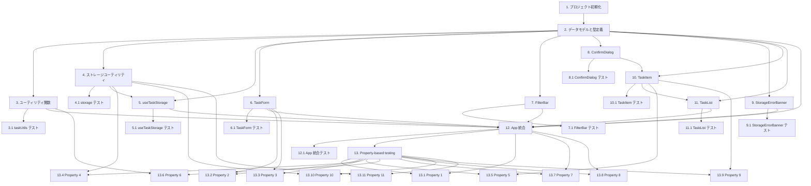

# Implementation Plan

## Overview

Vite + React + TypeScript で構築するシングルページの ToDo アプリ「TaskFlow」の実装計画です。型定義・ユーティリティ・ストレージ・カスタム Hook・各 UI コンポーネントを段階的に実装し、最後に App コンポーネントで統合します。

## Tasks

- [x] 1. プロジェクト初期化
  - Vite + React + TypeScript テンプレートでプロジェクトを作成する
  - Vitest・React Testing Library・fast-check を開発依存として追加する
  - Vitest の設定（`vitest.config.ts` または `vite.config.ts`）と jsdom 環境を設定する
  - `src/` ディレクトリ以下に `components/`・`hooks/`・`utils/` の基本ディレクトリ構造を作成する
  - _Requirements: なし（プロジェクト基盤）_

- [x] 2. データモデルと型定義
  - `src/types.ts` に `Task`・`TaskInput`・`FilterType` を定義する
  - Design の Data Models セクションで定義されたフィールドと型を正確に反映する
  - _Requirements: 1.1, 3.2, 6.1_

- [x] 3. ユーティリティ関数の実装
  - `src/utils/taskUtils.ts` に `filterTasks` と `generateId` を実装する
  - `filterTasks` は `FilterType` に応じて Task[] を純粋関数として絞り込む
  - `generateId` は `crypto.randomUUID()` を薄くラップする
  - _Requirements: 6.2, 6.3, 6.4_

  - [x] 3.1 taskUtils のテスト実装
    - `src/utils/taskUtils.test.ts` を作成し、ユニットテストを実装する
    - ユニットテスト: `filterTasks` の「全件」「未完了」「完了済み」各フィルターの具体例
    - _Requirements: 6.2, 6.3, 6.4_

- [x] 4. ストレージユーティリティの実装
  - `src/utils/storage.ts` に `saveTasks`・`loadTasks`・`isValidTaskList` を実装する
  - `saveTasks` は書き込み失敗時に例外を throw せず `{ ok: false }` を返す
  - `loadTasks` は成功時 `{ tasks: Task[] }`、失敗時 `{ error: 'parse' | 'schema' }` を返す
  - `loadTasks` はエラー時に localStorage の値を変更しない
  - `isValidTaskList` は配列および各要素のフィールド（id・title・description・dueDate・completed）の型を検証する
  - _Requirements: 7.1, 7.2, 7.3, 7.4, 7.5, 7.6, 7.7_

  - [x] 4.1 storage のテスト実装
    - `src/utils/storage.test.ts` を作成し、ユニットテストを実装する
    - ユニットテスト: 不正 JSON・スキーマ欠損・正常データの具体例、読み込みエラー時に localStorage が変更されないこと
    - _Requirements: 7.1, 7.2, 7.3, 7.4, 7.5, 7.6, 7.7_

- [x] 5. useTaskStorage カスタム Hook の実装
  - `src/hooks/useTaskStorage.ts` を作成する
  - マウント時に `loadTasks()` を呼び出し、成功時は `Task[]`・エラー時は `storageError = 'load'` をセットする
  - `tasks` が `null`（初期化前 / 読み込みエラー）の間は `saveTasks()` を実行しない
  - `tasks` が確定した後の変更のみ `useEffect` で `saveTasks()` を呼び出す
  - `saveTasks()` 失敗時は `storageError = 'save'` をセットする
  - 戻り値は `[Task[] | null, (tasks: Task[]) => void, 'load' | 'save' | null]`
  - _Requirements: 7.1, 7.2, 7.4, 7.5, 7.7_

  - [x] 5.1 useTaskStorage のテスト実装
    - `src/hooks/useTaskStorage.test.ts` を作成し、ユニットテストを実装する
    - 読み込み成功時に Task[] が返ること、読み込みエラー時に `storageError = 'load'` がセットされること
    - tasks 変更時に saveTasks が呼ばれること、書き込み失敗時に `storageError = 'save'` がセットされること
    - tasks が null の間は saveTasks が呼ばれないこと
    - _Requirements: 7.1, 7.2, 7.4, 7.5, 7.7_

- [x] 6. TaskForm コンポーネントの実装
  - `src/components/TaskForm/TaskForm.tsx` を作成する
  - `initialValues` が未指定の場合は新規作成モード、指定時は編集モードとして動作する
  - タイトルが空文字・空白のみの場合は送信を防止し「タイトルは必須です」バリデーションメッセージを表示する
  - バリデーションメッセージはフォームフィールドと `aria-describedby` で紐付ける
  - 送信完了後は全入力フィールドを空の初期状態にリセットする（新規作成モード時）
  - CSS Modules でスタイリングする
  - _Requirements: 1.1, 1.3, 1.4, 3.1, 3.4, 3.5, 8.1_

  - [x] 6.1 TaskForm のテスト実装
    - `src/components/TaskForm/TaskForm.test.tsx` を作成し、ユニットテストを実装する
    - ユニットテスト: 送信・キャンセル・バリデーションメッセージ表示の具体例
    - _Requirements: 1.3, 1.4, 3.4, 3.5_

- [x] 7. FilterBar コンポーネントの実装
  - `src/components/FilterBar/FilterBar.tsx` を作成する
  - 「全件」「未完了」「完了済み」の 3 ボタンをレンダリングする
  - アクティブなフィルターのボタンに `aria-pressed="true"` を付与する
  - CSS Modules でスタイリングする
  - _Requirements: 6.1, 6.5, 8.1, 8.2_

  - [x] 7.1 FilterBar のテスト実装
    - `src/components/FilterBar/FilterBar.test.tsx` を作成し、ユニットテストを実装する
    - フィルター切り替え時に `onChange` が呼ばれること、アクティブ状態の表示（`aria-pressed`）の確認
    - _Requirements: 6.1, 6.5_

- [x] 8. ConfirmDialog コンポーネントの実装
  - `src/components/ConfirmDialog/ConfirmDialog.tsx` を作成する
  - ネイティブ `<dialog>` 要素を使用する
  - 削除対象のタスクタイトルを表示する
  - 承認ボタン・キャンセルボタンを提供し、ESC キーでもキャンセルできるようにする
  - CSS Modules でスタイリングする
  - _Requirements: 4.1, 4.3, 8.1_

  - [x] 8.1 ConfirmDialog のテスト実装
    - `src/components/ConfirmDialog/ConfirmDialog.test.tsx` を作成し、ユニットテストを実装する
    - 承認・キャンセルボタンのインタラクション、タスクタイトルの表示確認
    - _Requirements: 4.1, 4.3_

- [x] 9. StorageErrorBanner コンポーネントの実装
  - `src/components/StorageErrorBanner/StorageErrorBanner.tsx` を作成する
  - `error === 'load'` 時: localStorage の修復・クリアとページ再読み込みを案内するメッセージを表示する
  - `error === 'save'` 時: ページ再読み込みにより未保存の変更が失われる可能性がある旨を通知する
  - バナー要素に `role="alert"` と `aria-live="assertive"` を付与する
  - CSS Modules でスタイリングする
  - _Requirements: 7.4, 7.5, 7.7, 8.2_

  - [x] 9.1 StorageErrorBanner のテスト実装
    - `src/components/StorageErrorBanner/StorageErrorBanner.test.tsx` を作成し、ユニットテストを実装する
    - 読み込みエラー・書き込みエラー時のメッセージ表示、`role="alert"` と `aria-live="assertive"` の付与確認
    - _Requirements: 7.4, 7.5, 7.7_

- [x] 10. TaskItem コンポーネントの実装
  - `src/components/TaskItem/TaskItem.tsx` を作成する
  - タイトル・説明（設定時のみ）・Due_Date（設定時のみ）・完了状態を表示する
  - 完了状態に応じてタイトルに打ち消し線スタイルを適用する
  - 完了切り替えコントロールに適切な ARIA 属性（`aria-checked` または `aria-label`）を付与する
  - 削除ボタン押下で `ConfirmDialog` を表示する
  - CSS Modules でスタイリングする
  - _Requirements: 2.2, 4.1, 5.1, 5.2, 5.4, 8.2_

  - [x] 10.1 TaskItem のテスト実装
    - `src/components/TaskItem/TaskItem.test.tsx` を作成し、ユニットテストを実装する
    - ユニットテスト: 完了切り替えボタン・編集ボタン・削除ボタンのインタラクション、説明・Due_Date の条件付き表示
    - _Requirements: 2.2, 5.1, 5.2, 8.2_

- [x] 11. TaskList コンポーネントの実装
  - `src/components/TaskList/TaskList.tsx` を作成する
  - フィルター適用済みの Task[] を受け取り、TaskItem を一覧レンダリングする
  - Task_List が空の場合は「タスクがありません」に相当する空状態メッセージを表示する
  - CSS Modules でスタイリングする
  - _Requirements: 2.1, 2.3, 2.4_

  - [x] 11.1 TaskList のテスト実装
    - `src/components/TaskList/TaskList.test.tsx` を作成し、ユニットテストを実装する
    - 空の Task_List での空状態メッセージ表示、Task が存在する場合の TaskItem レンダリング確認
    - _Requirements: 2.3_

- [ ] 12. App コンポーネントの実装と統合
  - `src/App.tsx` を実装し、全コンポーネントを統合する
  - `useTaskStorage` から `[tasks, setTasks, storageError]` を受け取る
  - `filter`（`FilterType`）と `editingTask`（`Task | null`）を `useState` で管理する
  - `addTask`・`updateTask`・`deleteTask`・`toggleTask` を実装し、各コンポーネントに渡す
  - `filterTasks` で絞り込んだ Task[] を `TaskList` に渡す
  - `storageError === 'load'` 時は TaskList の代わりに `StorageErrorBanner` を全幅表示する
  - `storageError === 'save'` 時は TaskList の上部に `StorageErrorBanner` をバナー表示する
  - `editingTask` が非 null の場合は `TaskForm` を編集モードで表示する
  - CSS Modules でスタイリングし、画面幅 320px 以上でレスポンシブに表示されることを確認する
  - _Requirements: 1.1, 1.2, 1.4, 2.1, 3.1, 3.2, 3.3, 3.5, 4.2, 4.3, 5.1, 5.2, 5.3, 6.1, 7.4, 7.5, 7.7_

  - [ ] 12.1 App の統合テスト実装（ユニットテスト）
    - `src/App.test.tsx` を作成し、統合ユニットテストを実装する
    - ユニットテスト: 読み込みエラー状態での `StorageErrorBanner` 全幅表示、書き込みエラー状態でのバナー表示
    - _Requirements: 1.1, 1.2, 3.2, 4.2, 7.4, 7.7_

- [ ] 13. Property-based testing（fast-check）
  - design.md の Correctness Properties 1〜11 を fast-check を使って実装する
  - 各プロパティテストは最小 100 回のイテレーションで実行する
  - 各テストには以下のコメントを付与する: `// Feature: taskflow-todo-app, Property {番号}: {プロパティの概要}`
  - _Requirements: 1.1, 1.3, 1.4, 3.2, 4.2, 5.1, 5.2, 6.2, 6.3, 6.4, 7.1, 7.2, 7.3, 7.4, 7.7, 8.2_

  - [ ] 13.1 Property 1 — 有効タスク追加によるリスト増加
    - `src/App.test.tsx` または `src/utils/taskUtils.test.ts` に追加する
    - 有効な（空白のみでない）タイトルを持つ TaskInput を追加した後、リスト長が +1 になり追加タスクのフィールドが一致することを検証する
    - アービトラリー: `fc.array(taskArb)`, `fc.string()` (non-blank)
    - _Requirements: 1.1_

  - [ ] 13.2 Property 2 — 空白タイトルの追加・編集拒否
    - `src/components/TaskForm/TaskForm.test.tsx` に追加する
    - 空白文字のみのタイトルを持つ TaskInput で追加・編集を試みても Task_List が変化しないことを検証する
    - アービトラリー: `fc.string()` filtered to whitespace-only
    - _Requirements: 1.3, 3.4_

  - [ ] 13.3 Property 3 — タスク操作後のフォームリセット
    - `src/components/TaskForm/TaskForm.test.tsx` に追加する
    - 有効な TaskInput を送信した後、フォームの全フィールドが空の初期値にリセットされることを検証する
    - アービトラリー: `fc.record({title, description, dueDate})`
    - _Requirements: 1.4_

  - [ ] 13.4 Property 4 — localStorage ラウンドトリップ
    - `src/utils/storage.test.ts` に追加する
    - 有効な Task[] を `saveTasks` で保存し `loadTasks` で読み込んだ結果が元の Task[] と深い等価性を持つことを検証する
    - アービトラリー: `fc.array(taskArb)`
    - _Requirements: 7.1, 7.2, 7.3_

  - [ ] 13.5 Property 5 — 完了切り替えの双方向性
    - `src/components/TaskItem/TaskItem.test.tsx` または `src/App.test.tsx` に追加する
    - `toggleTask` を 2 回適用した結果の `completed` フラグが元の値と等しいこと、および 1 回適用で状態が反転することを検証する
    - アービトラリー: `taskArb`
    - _Requirements: 5.1, 5.2_

  - [x] 13.6 Property 6 — フィルタリングの正当性と網羅性
    - `src/utils/taskUtils.test.ts` に追加する
    - `filterTasks` の結果がフィルター条件を満たし（精度）、条件を満たすタスクが漏れない（再現率）ことを検証する
    - アービトラリー: `fc.array(taskArb)`, `fc.constantFrom('all','pending','completed')`
    - _Requirements: 6.2, 6.3, 6.4_

  - [ ] 13.7 Property 7 — タスク編集後の同一性と更新
    - `src/App.test.tsx` に追加する
    - `updateTask` 適用後のリスト長が不変で、対象タスクの `id` が変化せず、フィールドが新しい値に置き換えられることを検証する
    - アービトラリー: `fc.array(taskArb, {minLength: 1})`, `taskInputArb`
    - _Requirements: 3.2_

  - [ ] 13.8 Property 8 — タスク削除後のリスト縮小と消去
    - `src/App.test.tsx` に追加する
    - `deleteTask` 適用後のリストに当該 `id` が存在せず、長さが 1 減少することを検証する
    - アービトラリー: `fc.array(taskArb, {minLength: 1})`
    - _Requirements: 4.2_

  - [ ] 13.9 Property 9 — TaskItem の ARIA 属性と完了状態の対応
    - `src/components/TaskItem/TaskItem.test.tsx` に追加する
    - `TaskItem` レンダリング時に完了切り替えコントロールの ARIA 属性が Task の `completed` フラグと一致することを検証する
    - アービトラリー: `taskArb` (completed true/false 両方)
    - _Requirements: 8.2_

  - [ ] 13.10 Property 10 — localStorage 読み込みエラー時のデータ保全
    - `src/utils/storage.test.ts` に追加する
    - 不正な JSON またはスキーマ不一致のデータが localStorage に存在するとき、`loadTasks()` 呼び出し後も localStorage の値が変化していないことを検証する
    - アービトラリー: `fc.string()` (non-JSON), `fc.object()` (invalid schema)
    - _Requirements: 7.4, 7.5_

  - [ ] 13.11 Property 11 — localStorage 書き込み失敗時のメモリ状態保全
    - `src/utils/storage.test.ts` に追加する
    - localStorage の書き込みが失敗するとき、メモリ上の Task_List が変化せず `saveTasks()` が `{ ok: false }` を返すことを検証する
    - アービトラリー: `taskArb`, mocked localStorage write failure
    - _Requirements: 7.7_

## Task Dependency Graph



```json
{
  "waves": [
    { "id": "wave-1", "taskIds": ["1"] },
    { "id": "wave-2", "taskIds": ["2"] },
    { "id": "wave-3", "taskIds": ["3", "4", "6", "7", "8", "9"] },
    { "id": "wave-4", "taskIds": ["3.1", "4.1", "5", "6.1", "7.1", "8.1", "9.1"] },
    { "id": "wave-5", "taskIds": ["5.1", "10", "11"] },
    { "id": "wave-6", "taskIds": ["10.1", "11.1", "12"] },
    { "id": "wave-7", "taskIds": ["12.1"] },
    { "id": "wave-8", "taskIds": ["13"] },
    { "id": "wave-9", "taskIds": ["13.1", "13.2", "13.3", "13.4", "13.5", "13.6", "13.7", "13.8", "13.9", "13.10", "13.11"] }
  ]
}
```

## Notes

- **実行順序**: Task 1（プロジェクト初期化）→ Task 2（型定義）を先に完了させてから、Task 3〜11 を並行または順次進めてください。Task 4 → Task 5 のように直接依存するものは順守が必須です。Task 12（App 統合）はすべての UI コンポーネントと Hook が揃ってから着手することを推奨します。

- **テストの進め方**: 各実装タスク（Task 3〜12）を完了したら、対応するテストサブタスク（3.1、4.1 … 12.1）をすぐに実装してください。実装とテストをセットで進めることで、設計の問題を早期に発見できます。プロパティテストは fast-check を使用し、ユニットテストと組み合わせてロジックの正しさを幅広く検証します。
